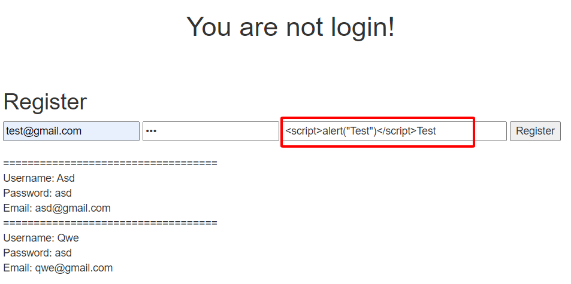
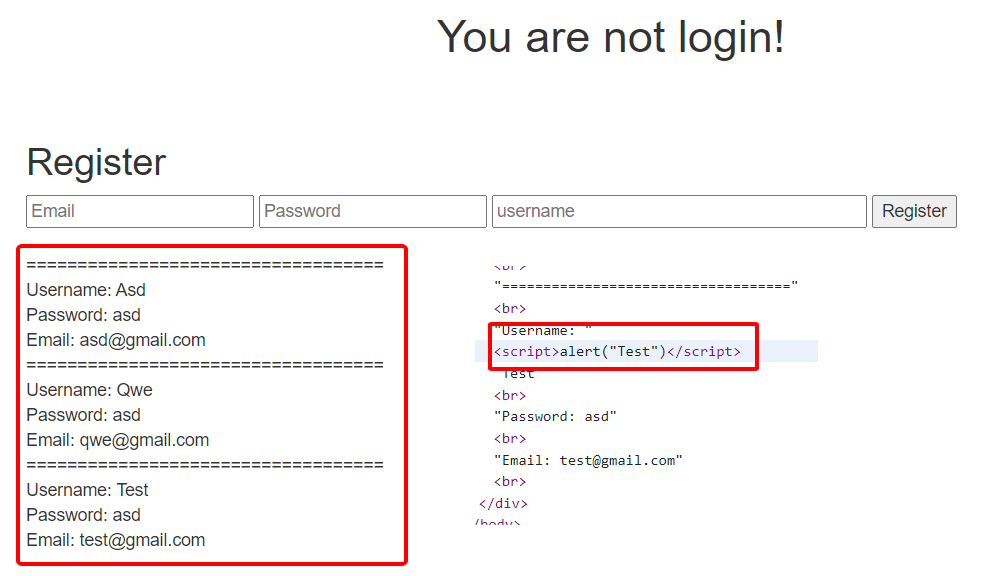
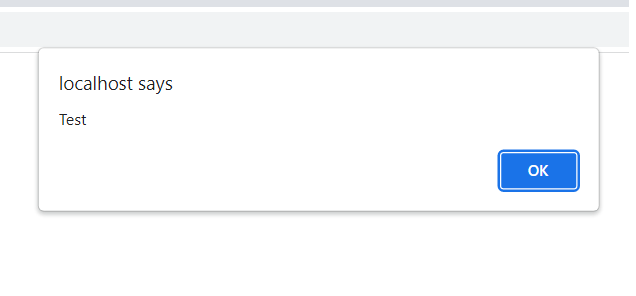

Người thực hiện: Lê Trần Văn Chương
Ngày: 12/04/2022
Mục lục:
- [Attributes của Cookie](#attributes-của-cookie)
- [Reflect XSS](#reflect-xss)
- [Stored XSS](#stored-xss)
- [Dom XSS](#dom-xss)
- [Ví dụ](#ví-dụ)

## Attributes của Cookie
- Cookie có cú pháp như sau `[Name: Value]`.
- Cookie có những thuộc tính sau:
1. Domain: Thuộc tính Domain được sử dụng để so sánh miền của cookie với miền của máy chủ mà yêu cầu HTTP đang được thực hiện. Nếu tên miền khớp hoặc nếu nó là một tên miền phụ, thì thuộc tính đường dẫn sẽ được kiểm tra tiếp theo.
2. Path: Thuộc tính Path đóng một vai trò quan trọng trong việc thiết lập phạm vi của cookie cùng với miền. Ngoài miền, có thể chỉ định đường dẫn URL mà cookie hợp lệ. Nếu miền và đường dẫn khớp, thì cookie sẽ được gửi trong yêu cầu.
3. Secure: Thuộc tính Secure yêu cầu trình duyệt chỉ gửi cookie nếu yêu cầu được gửi qua một kênh bảo mật như HTTPS. Điều này sẽ giúp bảo vệ cookie không bị chuyển qua các yêu cầu không được mã hóa.
4. Expires: Thuộc tính Expires được sử dụng để:
  - Đặt cookie liên tục.
  - Giới hạn time live nếu một phiên hoạt động quá lâu.
  - Loại bỏ một cách cưỡng bức một cookie bằng cách đặt nó thành một ngày trong quá khứ.
5. Httponly: Thuộc tính HttpOnly được sử dụng để giúp ngăn chặn các cuộc tấn công như rò rỉ phiên, vì nó không cho phép truy cập cookie thông qua tập lệnh phía máy khách như JavaScript.
6. SameSite: Thuộc tính SameSite cho phép máy chủ chỉ định xem, khi nào cookie được gửi cùng với các yêu cầu trên nhiều trang web. Ba giá trị có thể có:
  - `strict` - cookie chỉ được gửi đến trang web mà nó bắt nguồn.
  - `Lax` - cũng tương tự `strict`ngoại trừ việc cookie được gửi khi người dùng điều hướng đến trang web gốc của cookie (Nhấp vào liên kết bên ngoài).
  - `None` - cookie được gửi theo cả yêu cầu bắt nguồn và yêu cầu trên nhiều trang web, nhưng chỉ trong ngữ cảnh an toàn (nếu `SameSite=None` thì cũng phải khai báo thuộc tính `Secure` ở sau).
  
Và một số thuộc tính khác...

## Reflect XSS
Đây là lỗ hổng phổ `XSS` biến nhất. Kẻ tấn công phải gửi `payload` cho nạn nhân (`payload` này là 1 phần của yêu cầu được gửi đến máy chủ web và được phản hồi `HTTP`). `Reflect XSS` không phải là một cuộc tấn công liên tục, nên kẻ tấn công phải cung cấp payload cho mỗi nạn nhân.

## Stored XSS 
Là loại tấn công `XSS` gây thiệt hại nhiều nhất. Kẻ tấn công truyền các payload - được lưu trữ vĩnh viễn trên ứng dụng đích, chẳng hạn như `DB`.

## Dom XSS
Là loại tấn công XSS nâng cao, có thể thực hiện được khi tập lệnh phía máy khách của ứng dụng web ghi dữ liệu do người dùng cung cấp vào Document Object Model (DOM).

## Ví dụ
Đây là lab code đã bị lỗ hổng `XSS`.

- Tôi chèn 1 đoạn `script` vào `username` trong lúc thực hiện chức năng `Register`: `Test`

- Sau khi chèn xong thì ta thấy dữ liệu của `user` vừa register sẽ hiện ra bên dưới và ta không thấy đoạn `script` nào hết. Nhưng khi vào kiểm tra bên trong `source` sẽ thấy đoạn `script` ở trong đó. Và trong DB cũng chèn đoạn `script` đó.

- Bây giờ, load lại web thì đoạn `alert` đã truyền trước đó sẽ hiện lên.

